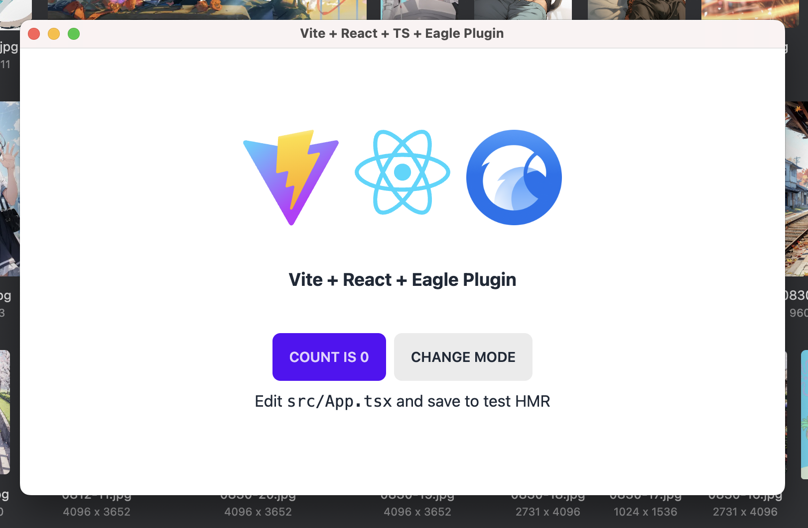

# eagle-react-template

React + TypeScript + Vite for Eagle plugin development, with Tailwind CSS, daisyUI, and the local-first `.eagleplus` packaging workflow.

For the upstream template reference and broader template workflow, see https://github.com/power-eagle/eagle-template.



## Stack

- React 19
- TypeScript 6
- Vite 8
- Tailwind CSS 4
- daisyUI 5
- pnpm

## Start

Install dependencies:

```sh
pnpm install
```

Build once:

```sh
pnpm build
```

Run lint:

```sh
pnpm lint
```

Run the watch build:

```sh
pnpm dev
```

## Template relationship

This repo keeps the plugin app in the repository root while template-managed automation lives under `.eagleplus/`.

- `.eagleplus/config/` defines packaging and template sync behavior
- `.eagleplus/scripts/` contains the local automation entrypoints
- `.github/workflows/package-plugin.yml` is the packaging workflow managed by the template
- `lefthook.yaml` is local workflow glue

For the original template rationale and shared workflow model, refer to the template source configured in `.eagleplus/config/template-target.json`: https://github.com/power-eagle/eagle-template.

## Packaging

Packaging is controlled by `.eagleplus/config/pkg-rules.json`.

Current shape:

```json
{
  "includes": [
    "dist/assets/**",
    "dist/index.html",
    "dist/vite.svg",
    "manifest.json",
    "logo.png"
  ],
  "ignore": [
    "node_modules/**"
  ],
  "i18n": false
}
```

Notes:

- Packaging patterns are evaluated relative to the repository root.
- Built files under `dist/` are packaged when they are explicitly included.
- Generated `.eagleplugin` archives are automatically excluded from package input.
- `manifest.json` is always written into the archive as generated output during packaging.
- `debug` packaging sets `devTools: true`.
- `release` packaging sets `devTools: false`.

Useful commands:

```sh
node .eagleplus/scripts/doctor.cjs
node .eagleplus/scripts/package-plugin.cjs --check
node .eagleplus/scripts/package-plugin.cjs release
node .eagleplus/scripts/package-plugin.cjs debug
node .eagleplus/scripts/package-local.cjs
```

`doctor.cjs` is the quickest way to verify the current file list that packaging resolves.

## Update workflow

Template sync behavior is controlled by `.eagleplus/config/template-target.json`.

Useful commands:

```sh
node .eagleplus/scripts/sync-template.cjs --dry-run
node .eagleplus/scripts/sync-template.cjs --force
```

The shared template behavior and automation model are documented in the upstream template repository configured in `.eagleplus/config/template-target.json`: https://github.com/power-eagle/eagle-template.

## Styling

- Tailwind CSS 4 is wired through `@tailwindcss/postcss`.
- daisyUI is loaded from `src/index.css` through Tailwind's plugin directive.
- The app builds to static assets in `dist/`, which are then used as package inputs.

## Notes

- This repo is pnpm-first.
- Packaging and validation scripts are cross-platform Node scripts.
- If packaging output looks wrong, run `node .eagleplus/scripts/doctor.cjs` first.
